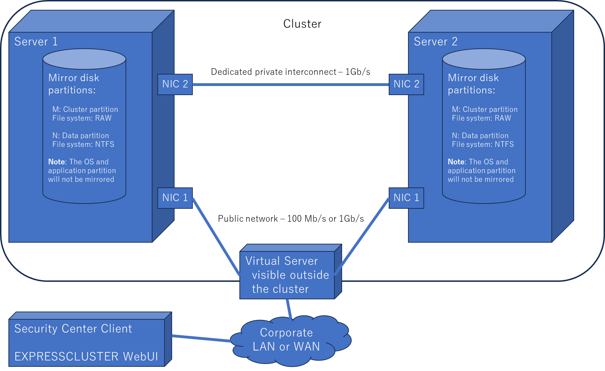
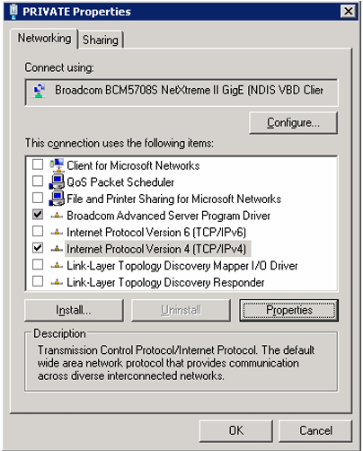
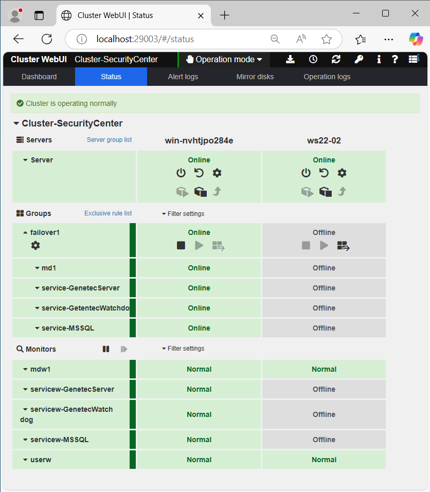
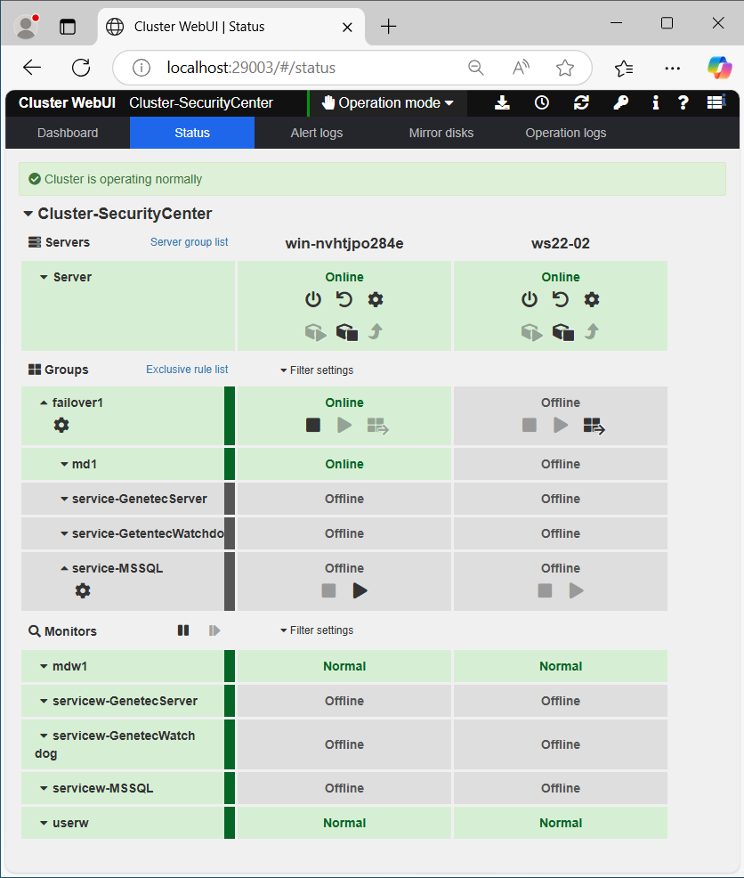
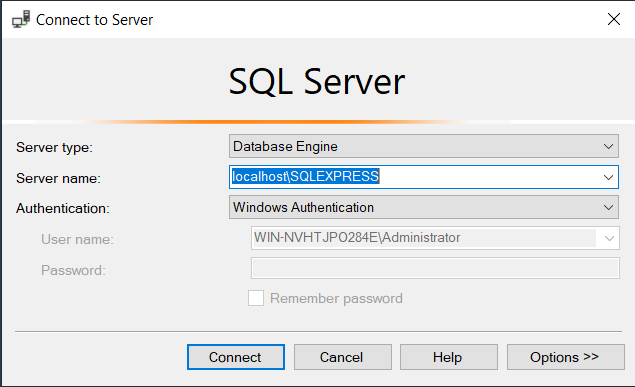
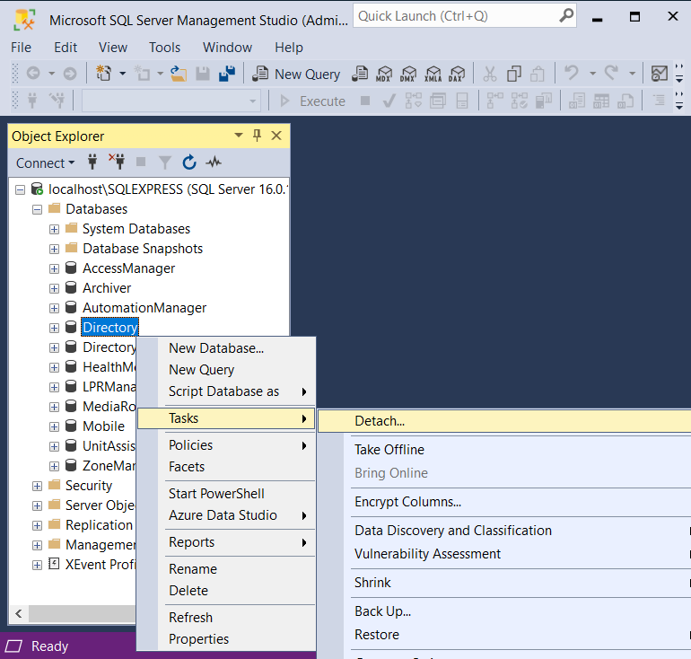
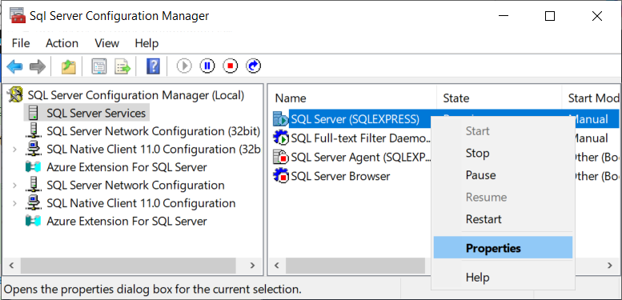
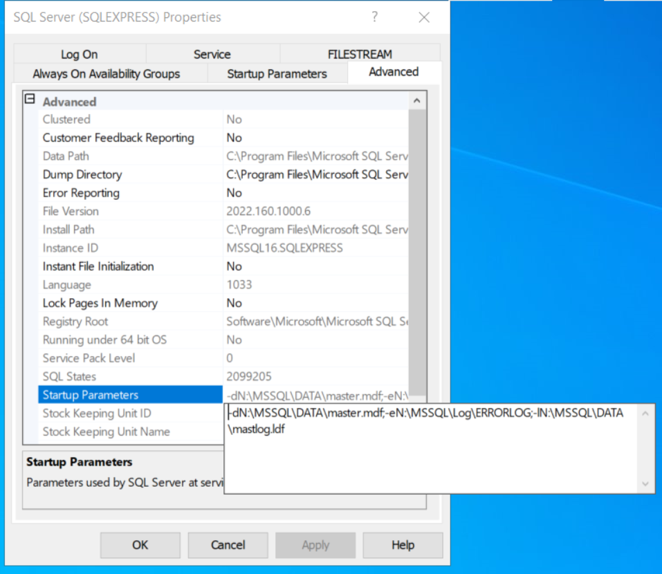
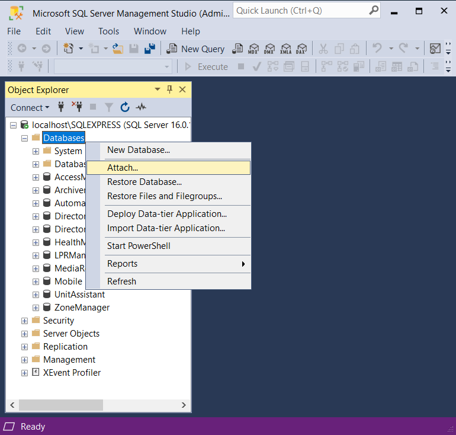

# Genetec Security Center and EXPRESSCLUSTER Quick Start Guide

This guide describes how to install and upgrade Genetec Security Center on a high availability cluster using EXPRESSCLUSTER.

## Table of contents

[Versions of products](#versions-of-products)

[EXPRESSCLUSTER for Security Center](#expresscluster-for-security-center)

[EXPRESSCLUSTER terminology](#expresscluster-terminology)

[Server requirements for EXPRESSCLUSTER](#server-requirements-for-expresscluster)

[Planning checklist for EXPRESSCLUSTER](#planning-checklist-for-expresscluster)

[Preparing servers for clustering](#preparing-servers-for-clustering)

[Best practices for installing EXPRESSCLUSTER](#best-practices-for-installing-expresscluster)

[Installing Security Center Server for EXPRESSCLUSTER](#installing-security-center-server-for-expresscluster)

[Upgrading Security Center](#upgrading-security-center)

[Configuring services for the cluster](#configuring-services-for-the-cluster)

[Configuring EXPRESSCLUSTER](#configuring-expresscluster)

[Cluster configuration tests](#cluster-configuration-tests)

[Upgrading EXPRESSCLUSTER](#upgrading-expresscluster)

[Legal notice](#legal-notice)

## Versions of products

- Genetec Security Center 5.12
  - Microsoft SQL Server 2022 Express
- EXPRESSCLUSTER X 5.2 for Windows
- Windows Server 2022

## EXPRESSCLUSTER for Security Center

EXPRESSCLUSTER provides synchronous data mirroring between two servers.
Fast application recovery and data protection is ensured in case of a system failure.
Clustering ensures that your Security Center server’s configuration files and database files found on one server are mirrored on another server.
A virtual IP address is used to accept incoming client connections. The cluster then monitors the active server’s hardware and software. If a failure is detected, the cluster replaces the active server with the standby server so that the system remains online.
Clients do not know whether the active server or the standby server is managing the system as they are still connected to the same IP address.



## EXPRESSCLUSTER terminology

The following terms are used to describe the components of EXPRESSCLUSTER

| Term | Description |
|--    |--           |
| Public network | The network hosting the Security Center server and clients. |
| Private network | Also known as *Interconnect network* The dedicated link connection the two clustered servers together. |
| Active node | The clustered server actively managing Security Center. |
| Standby node | The clustered server waiting on standby. |
| Heartbeat | A signal that servers in a cluster send to each other to detect a failure in the cluster. |

## Server requirements for EXPRESSCLUSTER

Your servers should be identical in terms of hardware, operating system, and software.
EXPRESSCLUSTER, SQL server, and Security Center each have their own set of minimum requirements.
The following table lists the minimum requirements as a combination of all three:

| Component | Requirements |
|--         |--            |
| CPU and memory | Refer to the Security Center System Requirements (<https://resources.genetec.com/system-requirements>) for the most recent version of this document. |
| Operating system | Refer to EXPRESSCLUSTER System Requirements. **NOTE**: English and Japanese operating systems are only supported by EXPRESSCLUSTER.|
| Disk partitions | Each server will need two identically configured disk partitions (apart from C:/). One for the cluster partition (1 GB RAW) and one for the mirrored partition (40 GB or more NTFS). These partitions should not be on the same physical disk as the operating system and software, so two physical hard drives are required. **IMPORTANT**: For systems with more than 1,000 entities (cameras, doors, cardholders, etc) three physical hard drives are required for performance reasons. |
| Network cards | Each server will need two network cards. One to accept external client connections and the other for the cluster’s interconnection. 1Gb/s cards are recommended. |
| SQL Server | SQL Server Express is bundled on the Security Center download package. But for installations where the database size will grow over 10 GB (very rare), two copies of SQL Standard or Enterprise will be needed. |
| Database management tool | SQL Management Studio needs to be installed on both servers. |

<!--
## Security Center system requirements

For Security Center to perform as expected, the following hardware and software components are required. To determine which configuration is best suited for your application, contact Genetec Sales Engineering team at <salesengineering@genetec.com>.
-->

## Planning checklist for EXPRESSCLUSTER

You will need to know the following information before starting your cluster installation.

| Cluster component | Description | Your system |
|--                 |--           |--             |
| Cluster name | Name of the cluster configuration.||
| Failover group name | Name of the failover group ||
| Floating IP | Static IP address used by clients to access Security Center services within the cluster. ||
| Cluster partition | Drive letter for the cluster partition of the mirrored disk ||
| Data partition | Drive letter for the data partition of the mirrored disk ||
| Virtual computer name | Name to be used to access the server (Active or Standby) currently hosting the Security Center services. ||
| Active Node name | Name of the active server used in cluster configurations. ||
| Active Node Public IP address | Static IP address used in the public IP network. ||
| Active Node Public Subnet mask | Subnet mask used in the public IP network. ||
| Active Node Public Default Gateway | Default Gateway used in the public IP network. ||
| Active Node Public Preferred DNS server address | Static IP address of the Preferred DNS server in the public IP network. ||
| Active Node Private IP | Static IP address used in the interconnect IP network. ||
| Active Node Private Subnet mask | Subnet mask used in the interconnect IP network. ||
| Standby Node Name | Name used for identification in the cluster configuration. ||
| Standby Node Public IP | Static IP address used in the public IP network. ||
| Standby Node Public Subnet mask | Subnet mask used in the public IP network. ||
| Standby Node Public Default Gateway | Default Gateway used in the public IP network. ||
| Standby Node Public preferred DNS server |  Static IP address of the Preferred DNS server in the public IP network. ||
| Standby Node Private IP | Static IP address used in the interconnect IP network. ||
| Standby Node Private Subnet mask | Subnet mask used in the interconnect IP network. ||

## Preparing servers for clustering

Before installing EXPRESSCLUSTER, you must prepare the servers.

### To prepare your servers for clustering

1. Make sure that each server has two network cards and two physical hard disks.
2. Configure your first hard disk with one partition only. It will be used for your operating system and software.
3. Configure your second hard disk with two partitions. One is called the cluster partition (1 GB raw) and the other is called the data partition (40 GB or more, NTFS). The data partition will contain Security Center’s SQL database files as well as the server’s configuration files. This data will be mirrored between the two servers.  
**IMPORTANT**:  Not only must the partitions be identical on both servers, but the drive letters assigned must also be identical.
4. Create the following folders on the data partition for mirroring:

   - N:\Genetec Security Center 5.11\ConfigurationFiles
   - N:\MSSQL\DAT
   - N:\VertX

   **NOTE**:  In this example “N:” is the drive letter assigned to your mirrored data partition. The folder N:\VertX is only necessary if you are using HID VertX controllers.
5. If your system has more than 1,000 entities, or requires extensive reporting, a third disk should be configured with another cluster partition and data partition. SQL’s \*.ldf files will be clustered from one disk and SQL’s \*.mdf files will be clustered from another physical disk. This step is added for performance stability in larger systems.
6. Install the same operating system on both servers.
7. In Windows, rename the first network card as “Public”. This is the network interface that will accept incoming client connections. Repeat on the second server.
8. Rename the second network card as “Private”. This is for the dedicated interconnection
 between the two clustered servers. Repeat on the second server.
9. On each server, configure the Public network card to use the same IP subnet.
10. On each server, configure Private network card to use the same IP subnet.
11. Disable all network card features of the *Private* NIC except TCP/IP version 4 (and, if it appears in the list, the driver).
    
12. From the command line, test whether the two servers can *ping* each other over their public interface and over their private interface.
<!--
9. Order the Public and Private network interfaces as follows:
 **IMPORTANT**:  The network interface on the Private network must be Window’s first available network
 interface.
   1. Log on to the first node in the cluster using an administrative Windows account.
   2. Click Start > Run, and type ncpa.cpl.
   3. In the Network Connections window, click the Advanced menu, and then click Advanced settings.  
      **TIP**:  If the Advanced menu does not appear at the top of the window, press Alt.
   4. In the Connections list, select the Private network connection, and use the arrow buttons on the right to bring it to the top of the list.
   5. Click OK.
   6. Repeat the steps on all remaining cluster nodes.
-->

## Best practices for installing EXPRESSCLUSTER

It is assumed that you are familiar with the concept of clustering and how to install and configure the EXPRESSCLUSTER X for Windows.
When installing the EXPRESSCLUSTER software, keep the following points in mind:

- EXPRESSCLUSTER can be set up with several different configurations. Note that we are using its High availability cluster configuration using mirror disks with 2 nodes.
- The EXPRESSCLUSTER should be installed on the servers’ C:/ drive, not a mirrored disk.
- The identical folder path is required on both servers for the EXPRESSCLUSTER installation.
- The EXPRESSCLUSTER licenses key files will be required after the installation.

For more information about the EXPRESSCLUSTER X for Windows, see the NEC documentation supplied with the EXPRESSCLUSTER software, or available at <https://www.nec.com/en/global/prod/expresscluster/en/doc/manual.html> or <http://support.necam.com/EnterpriseSW/EC>

## Installing Security Center Server for EXPRESSCLUSTER

After the EXPRESSCLUSTER software has been installed, you must install Security Center Server and SQL Server on your active server first, and then on your standby server.

1. Installing Security Center

   1. Execute `setup.exe`
   2. On setting *Database Server*

      Select `Install a new database server` (change from *Use an existing database server*).

   3. On setting *Database Server Authentication*

      Select *SQL Server and Windows authentication (mixed mode)* (change from *Windows authentication**).

      Input `sa` as *Username* and `Password-0` as *Password* for example.

2. Configuring SQL Server : enabling login property of *sa* user

   1. Open *SQL Server Management Studio*
   2. Connect to `localhost\SQLEXPRESS` with *Windows Authentication*
   3. Go to *Security/Logins*. Confirm if `sa` user is in Disabled status.
   4. If disabled, open **Login Properties** of *sa* user. Go to *Status*. Select `Enabled` for *Login* then click *OK*.

3. Configuring Security Center

   1. Open `http://localhost/Genetec/` and login to *Security Center Server Admin*
   2. Install the license.
   3. Enable the database
      1. Click the hostname in left pane.
      2. Select `SQL Server` as *Authentication* (change from *Windows*).
      3. Input `Password-0` as *Password* for example.

4. Configuring Security Center - Optionally adding an RTSP video stream as an example

   1. Open *Genetec Config Tool*. `admin` with no password is used for first time login.
   2. Set admin password `Password-0` (example).
   3. Go to *Tasks*` > *Video*
   4. Click *+Video unit*, set followings then *Add and close*
  
      - *Manufacturer*: `Generic Stream`
      - *Product type*: `*RTSP(No ping)`
      - rtsp://`10.0.0.10/live` (assuming RTSP server runs on 10.0.0.10)
      - *Authentication*: `Default logon`

      Installation and configuration of the RTSP server is described [here](vCamera.md).

## Upgrading Security Center

To upgrade Security Center in an EXPRESSCLUSTER environment, you must disable automatic failover for the EXPRESSCLUSTER, and then upgrade Security Center on the active and standby servers.

### Before you begin

You must have the same ConfigurationFiles folder on both the mirrored and local hard drives.

1. As a backup, Copy the ConfigurationFiles folder from the mirrored drive (N:Genetec Security Center 5.12\ConfigurationFiles) to your local drive (C:\Program Files (x86)\Genetec Security Center 5.12\ConfigurationFiles).
2. Repeat for each server in your cluster.

   **NOTE***: In this example “N:” corresponds to the drive letter assigned to your mirrored data partition. The actual drive letter will depend on your EXPRESSCLUSTER.

### To upgrade Security Center

1. Open *Cluster WebUI*.

   On the primary server, open *WebUI* of EXPRESSCLUSTER by opening a web browser and access to <http://localhost:29003>

2. Confirm that the failover group is running on the primary server.

   

3. Stop *service-MSSQL*, then *service-GenetecServer* and *service-GenetecWatchdog* are also stopped and are in Offline status, and *md1* remains in *Online* status.

   

4. Upgrade the Security Center on the primary server.
5. Move the failover group to the secondary server, then confirm the mirror disk resource *md1* only in active status.

   

6. Upgrade the Security Center on the secondary server.
7. Start *service-Genetec*, then all the resources become online.
8. Move the failover group to the primary server.

## Configuring services for the cluster

You must make some changes to Security Center Server to be protected with failover by the cluster.

Before configuring, Stop Security Center services and set the *Startup Type* of them into *Manual startup*. Open *cmd.exe* then issue the following commands

```bat
sc qc     GenetecServer
sc stop   GenetecServer
sc config GenetecServer   start= demand
sc qc     GenetecServer

sc qc     GenetecWatchdog
sc stop   GenetecWatchdog
sc config GenetecWatchdog start= demand
sc qc     GenetecWatchdog

sc qc     MSSQL$SQLEXPRESS
sc stop   MSSQL$SQLEXPRESS
sc config MSSQL$SQLEXPRESS start= demand
sc qc     MSSQL$SQLEXPRESS
```

**To configure Security Center Server for the cluster:**

1. Move the server's license file to a non-mirrored folder, and move the configuration files to a mirrored disk.
2. Stop the Genetec™ Watchdog service from restarting the Genetec™ Server service
   The cluster will monitor and control the Genetec™ Server service, so you do not want the Genetec™ Watchdog service trying to start or stop the server anymore.

### Moving Security Center server's license and configuration files

As part of configuring Security Center Server for a clustered environment, you must move the server's license file to a non-mirrored folder, and move the configuration files to a mirrored disk.

**To move Security Center server's license and configuration files:**

1. On both servers, stop the Genetec™ Watchdog service and the Genetec™ Server service.

   <!--
   1. Click **Start > Control Panel > Administrative Tools > Services**.
   2. Select the *Genetec™ Watchdog service* and click **Stop Service** on the toolbar at the top of the page.
   3. Select the Genetec Server service and click **Stop Service** on the toolbar at the top of the page.
   4. Minimize, but don't close the Services window.
   -->

2. Move the Genetec™ Server's license file (*license.gconfig*) from *C:\Program Files (x86)\Genetec Security Center 5.12\ConfigurationFiles* to the Security Center root folder (*C:\Program Files (x86)\Genetec Security Center 5.12*).
3. Using Notepad, paste the following text into an empty text file:

   ```xml
   <?xml version="1.0" encoding="utf-8" ?>
   <configurationPath path="N:\Genetec Security Center 5.12\ConfigurationFiles">
   <forceRoot name="License"/>
   </configurationPath>
   ```

   This file contains four lines. It will point to your mirrored data drive (“N:” is used in the example) as the location of your configuration files and your local root folder as the location of your license file. If your mirrored data drive is configured differently, adjust the file with your mirrored drive path.

4. Save the text file with the name *ConfigurationPath.gconfig* in your Security Center root folder (*C:\Program Files (x86)\Genetec Security Center 5.12*)
5. Repeat the steps on your standby server.
6. Copy the folder *ConfigurationFiles* in the Security Center root folder on the active server to the mirrored data drive.

   ```bat
   robocopy 'C:\Program Files (x86)\Genetec Security Center 5.12\ConfigurationFiles' 'N:\Genetec Security Center 5.12\ConfigurationFiles'
   ```

A supplementary server configuration file called *ConfigurationPath.gconfig* is created. This file tells the server to look in an alternative path for your configuration files (the mirrored data drive) and an alternative path for
the server license.

### Stopping Genetec™ Watchdog from restarting Genetec™ Server

Once clustering is set up, the cluster will monitor and control the Genetec™ Server service, so you do not want
the Genetec™ Watchdog service trying to start or stop the Genetec™ Server service anymore.

**To stop the Genetec™ Watchdog service from restarting the Genetec™ Server service:**

1. Use Notepad to open the file GenetecWatchdog.gconfig found in the path `N:\Genetec Security Center 5.12\ConfigurationFiles`.
2. Edit the file to include the string: `preventServiceRestart="true"`.
The third line now reads:

   ```xml
   <Watchdog serverPort="4534" registrationRetryDelay="00:00:15"
   responsivenessTimeout="00:02:00" emailFilterLevel="None"
   preventServiceRestart="true">
   ```

3. Repeat the steps on your standby server.
4. Start the Genetec™ Server service on both servers.

### Configuring SQL Server for the cluster

To configure your SQL database server for a clustered environment, you must move the database to your mirrored data partition so that the contents of the database are identical on the active server and the
standby server.

To configure the SQL Server for the cluster:

1. On both servers, stop the Genetec™ Watchdog service and the Genetec™ Server service as follows:
   1. Click Start > Control Panel > Administrative Tools > Services
   2. Select the Genetec™ Watchdog service and click Stop Service on the toolbar at the top of the page.
   3. Double-click the Genetec™ Watchdog service and set the Startup Type to Manual .
   4. Select the Genetec Server service and click Stop Service on the toolbar at the top of the page.
   5. Double-click the Genetec™ Server service and set the Startup Type to Manual.
   6. Double-click the SQL Server (SQLEXPRESS) and set the Startup Type to Manual.
2. In SQL Management Studio, you will need detach all Security Center databases before the database files can be moved to your mirrored data partition. Detaching a database removes it from the instance of the Microsoft SQL Server but leaves intact the database, with its data files and transaction log files.
   1. Open SQL Management Studio and connect to the Security Center database instance (by default the instance name is SQLEXPRESS)
   
   2. Right click on each one of the Security Center databases and select `Task` > `Detach`.
   
3. Move the Security Center \*.MDF and \*.LDF database files from their default folder (*C:\Program Files\Microsoft SQL Server\MSSQL16.SQLEXPRESS\MSSQL\DATA*) to the SQL folder on the mirror partition created earlier (*N:/MSSQL/DATA*).
4. Stop the SQL service on both servers.
5. Using SQL Server Configuration Manager, modify the SQL startup parameters for the master database on both servers.

   1. Open your SQL Server Configuration Manager.
   2. Select **SQL Server Services** in the pane on the left.
   3. Right-click on **SQL Server (SQLEXPRESS)** and select **Properties**.
      
   4. Select the **Advanced** tab in the **SQL Server (SQLEXPRESS) Properties** window.
   5. Double click and modify the field **Startup Parameters** to point to the new master database path.
      
      In this example I have modified the startup parameters to: `-dN:\MSSQL\DATA\master.mdf;-eN:\MSSQL\Log\ERRORLOG;-lN:\MSSQL\DATA\mastlog.ldf`,
      whereby the field points to the new (mirrored) drive and folder path of our master database (*N:/MSSQL/Data*).

6. Move the master database (master.mdf and master.ldf) for the active server to the SQL folder on the mirror partition created earlier (*N:/MSSQL/DATA*). Delete the master database (master.mdf and master.ldf) on the standby server (it will be replicated from the active server).
   - Do the same for *model*, *msdb*, and *tempdb* databases.
7. Restart SQL service on both servers.
8. Reconnect SQL Management studio to SQL server for the active server.
9. Re-attach the Security Center databases.

   - Right-click on **Databases** and select **Attach**.
     

10. When prompted to point to the database to be attached, use the **Add** button to browse to the new path of your (moved) master database.

    **IMPORTANT**: This step needs to be performed on the standby server as well but it is not possible at this
    point. Once the cluster configuration has been completed, you will need to force a failover to the standby
    server, then connect SQL Management Studio to its SQL server to re-attach the same databases.

11. Make sure that all the databases that were previously detached are re-attached.

## Configuring EXPRESSCLUSTER

On both servers, put ECX license files, then run ECX installer.

After the ECX installation, issue the following commands in the command prompt to install the cluster license files and to add the firewall rules.

```bat
REM Installing the license files
cd THE_FOLDER_CONTAINING_THE_CLUSTER_LICENSE_FILE
clplcnsc -i .\*

REM Adding the firewall rules
clpfwctrl --add
```

### Creating the cluster

1. On either of the servers, open EXPRESSCLUSTER *WebUI*.

   Open a web browser and access to <http://localhost:29003>

2. Start *Cluster generation wizard*.

   Configure one failover group and add the following resources to the group.

   - Mirror disk resource. Name it *md1*.
   - Service resource for *SQL Server (SQLEXPRESS)* service. Name it *service-MSSQL*.
   - Service resource for *Genetec Watchdog* service. Name it *service-GenetecWatchdog*.

     Configure it to depend on the service resource for *SQL Server* service.

   - Service resource for *Genetec™ Server* service. Name it *service-GenetecServer*.

     Configure it to depend on the service resource for *Genetec Watchdog* service.

     **NOTE** : For the *Service Name*, configure not `Genetec™ Server` but `GenetecServer`. Trademark symbols are not allowed in the *Service Name*.

## Cluster configuration tests

- If you see a trouble on Security Center regarding database connection. On active server, open *Genetec Config Tool* > *System* > *Roles* > select each Roles > *Resources* > Try `localhost\SQLEXPRESS`
- Move and move back the failover group between the servers.
- A state transition test
  1. Power off the primary server. Then see if the failover is successfully processed.
  2. Power on the primary server. Then see if the server is successfully comeback to the cluster.
  3. Move back the failover group.

## Upgrading EXPRESSCLUSTER

### Notes

- EXPRESSCLUSTER X 4 obsoletes *armload*/*armkill* commands.

  If you have been using a *script resource* which contains *armload*/*armkill* command in the *start.bat*/*stop.bat* for controlling three services of *Genetec™ Server*, *Genetec Watchdog* and *SQL Server* services, you need to replace the *script resource* into three *service resources*.

- EXPRESSCLUSTER X 5 requires a Cluster partition of 1 GB for a *Mirror disk* resource, not 64 MB.

  If you have been using the Cluster partition having the size less than 1 GB, you need to prepare new partition of 1 GB (or more).

### Steps

1. Before the upgrade, open EXPRESSCLUSTER *WebManager* and save the existing configuration files (*clp.conf* and *scripts*).
2. Upgrade EXPRESSCLUSTER.

   Uninstall the old and install new one.

3. Open EXPRESSCLUSTER *WebUI* and import the saved configuration.
4. Delete the script resource and add the service resources for *Genetec™ Server*, *Genetec Watchdog* and *SQL Server* services if required. Note about the dependency described [here](#creating-the-cluster).
5. Change the *Cluster Partition Drive Letter* in the *Resource Properties* of the *Mirror disk* resource if required.

## Legal notice

©2025 NEC. All rights reserved.

The contents of this guide are furnished for informational use only and are subject to change without notice.
NEC assumes no responsibility or liability for any errors or inaccuracies that may appear in the informational content contained in this guide.

This publication may not be copied, modified, or reproduced in any form or for any purpose, nor can any derivative works be created there from without NEC’s prior written consent.

NEC reserves the right to revise and improve its products as it sees fit. This document describes the state of a product at the time of document’s last revision, and may not reflect the product at all times in the future.

In no event shall NEC be liable to any person or entity with respect to any loss or damage that is incidental to or consequential upon the instructions found in this document or the computer software and hardware products described herein.

EXPRESSCLUSTER® is a registered trademark of NEC Corporation.
Trademarks used in this document may be trademarks of the manufacturers or vendors of the respective products.

All specifications are subject to change without notice.
